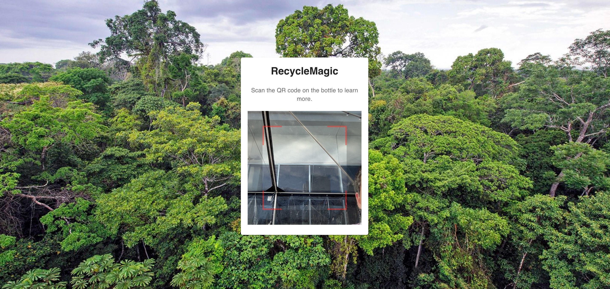

# RecycleMagic

## 🌟 Inspiration
Tracking where recyclables end up is a global challenge. Many recycling plants and facilities lack the technology to monitor the journey of recyclables, leading to inefficiencies and missed opportunities for proper waste management. **RecycleMagic** aims to bridge this gap by providing a seamless, tech-driven solution.

---

## 🚀 What It Does
**RecycleMagic** uses **QR codes** to track recyclables from the point of disposal to recycling plants.  
- When recyclables arrive at a recycling plant, their QR codes are scanned and logged into our system.
- If a recycling plant lacks internet connectivity, the **Skylo satellite IoT device network** ensures data is transmitted without interruptions.

---

## 🛠️ How We Built It
We leveraged modern technologies to create **RecycleMagic**:
- **Frontend**: Built with **React.js** and styled for user-friendly interactions.
- **Backend**: Developed using **Reflex.Dev** for robust server-side operations.
- **Data Transmission**: Configured **UDP servers** to facilitate seamless communication.
- **Cloud Infrastructure**: Utilized **AWS EC2** and **Google Firebase** for hosting and data storage.
- **IoT Integration**: Integrated **Skylo satellite IoT devices** for internet-independent connectivity.

---

## 🚧 Challenges We Ran Into
- Establishing a connection to the **Skylo satellite network** proved to be a significant challenge due to technical limitations and configuration requirements.
- Managing real-time data transmission while ensuring system reliability.

---

## 🏆 Accomplishments That We're Proud Of
- Successfully built and deployed **three web applications** to demonstrate RecycleMagic's capabilities.
- Successfully set up **UDP servers** for data transmission, enabling seamless communication between devices and the system.

---

## 📚 What We Learned
- **Satellite Networks**: Gained hands-on experience working with IoT devices and satellite-based data transmission.
- **Full-Stack Development**: Enhanced our skills in building scalable applications with modern frameworks and cloud services.
- **Collaboration**: Learned the value of teamwork and efficient problem-solving under tight deadlines.

---

## 🚀 What's Next for RecycleMagic
- **Expanding QR Code Tracking**: Integrate with more recycling plants and facilities worldwide.
- **AI-Based Insights**: Incorporate machine learning to analyze recycling data and optimize processes.
- **Mobile App Development**: Build a companion app for users to track their recyclables' journey.
- **Enhanced IoT Integration**: Improve satellite connectivity and support additional IoT devices.

---

## 🛠️ Built With
- **Firebase**
- **MongoDB**
- **Pandas**
- **Python**
- **React.js**
- **Reflex.Dev**
- **Skylo IoT Network**

## 🌟 Team Member
- Khanh Khuat
- Kevin Wang
- Abdur Aziz
- Shiyue Wang